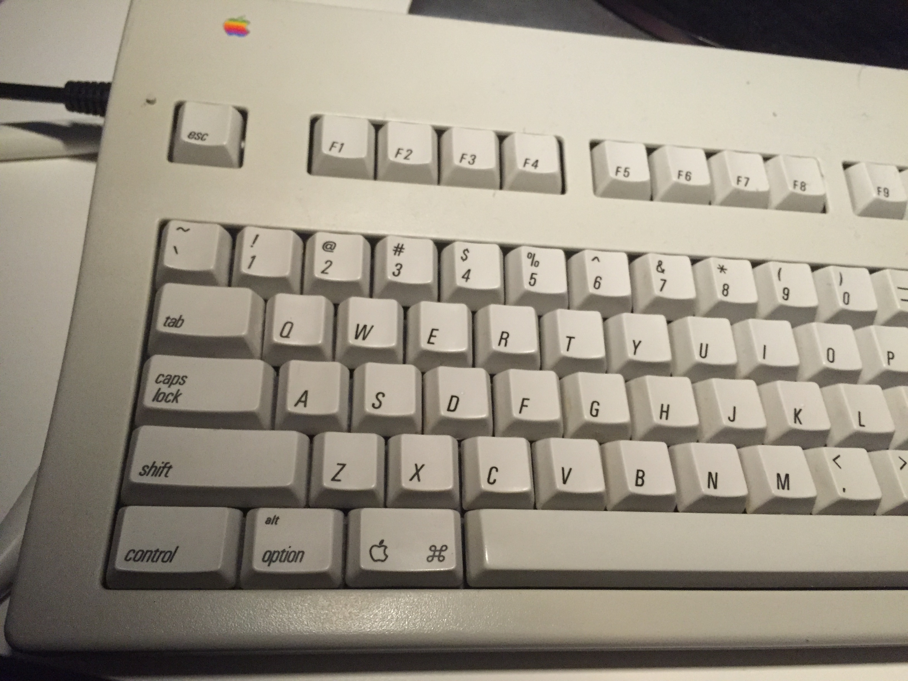
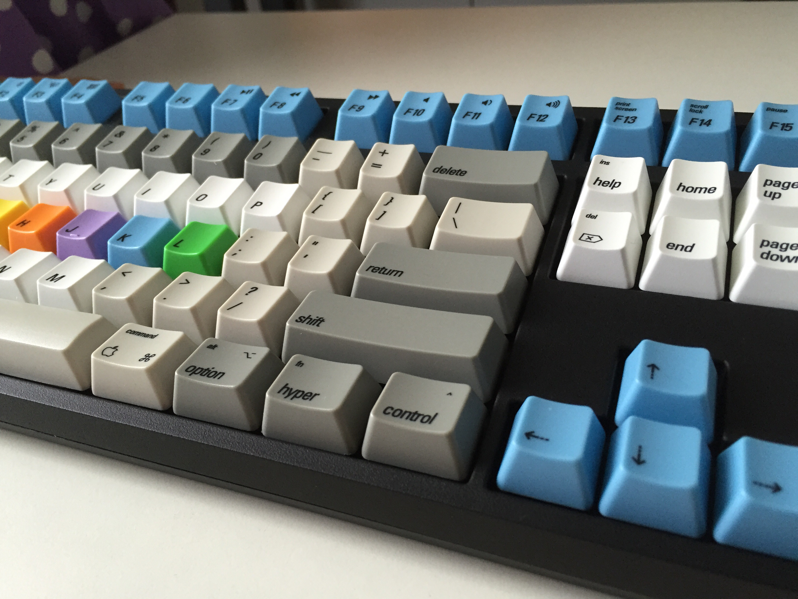
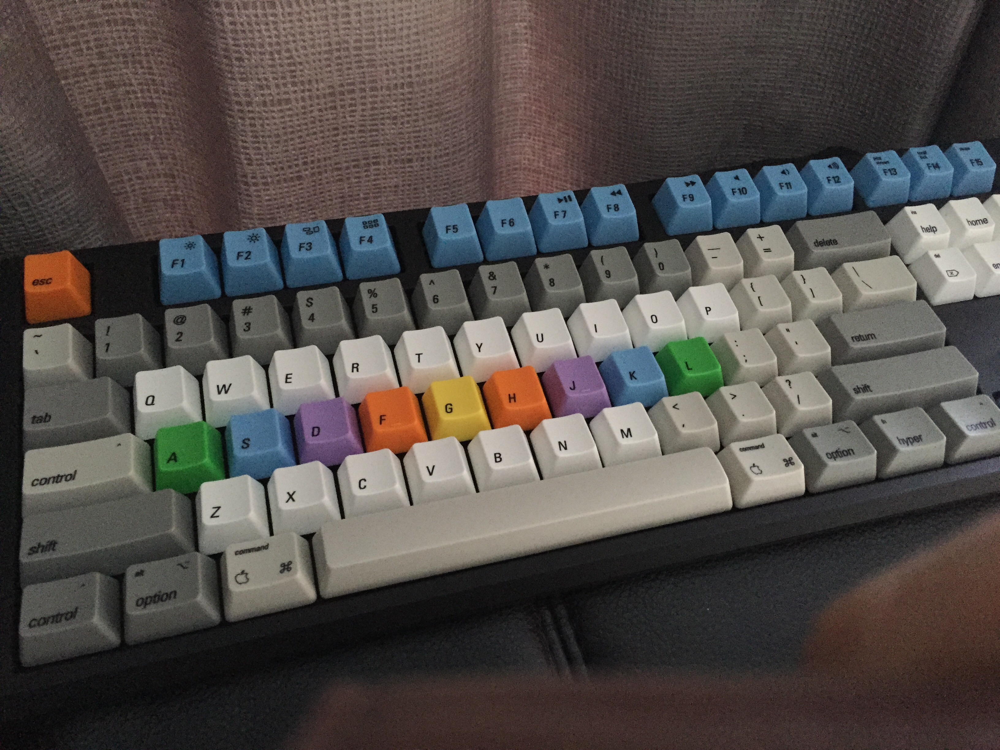
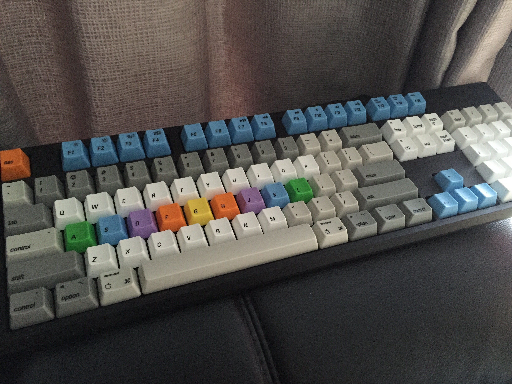
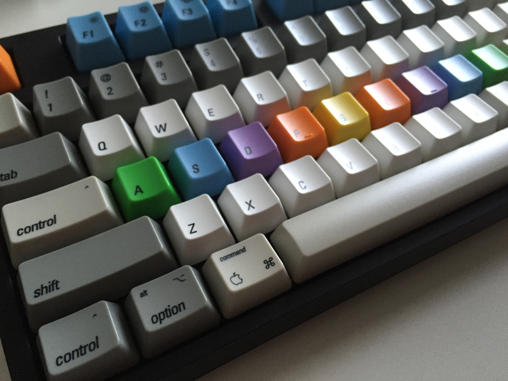
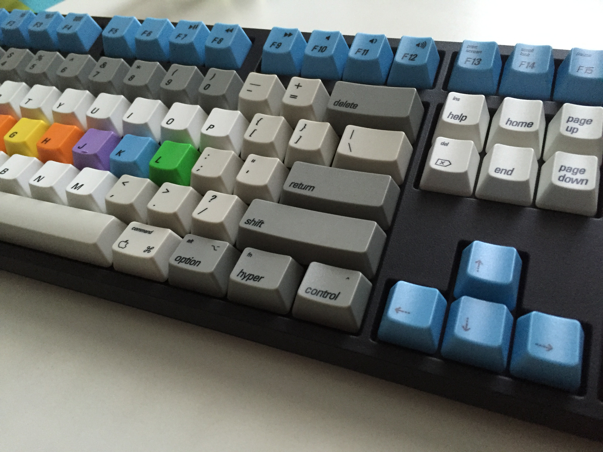
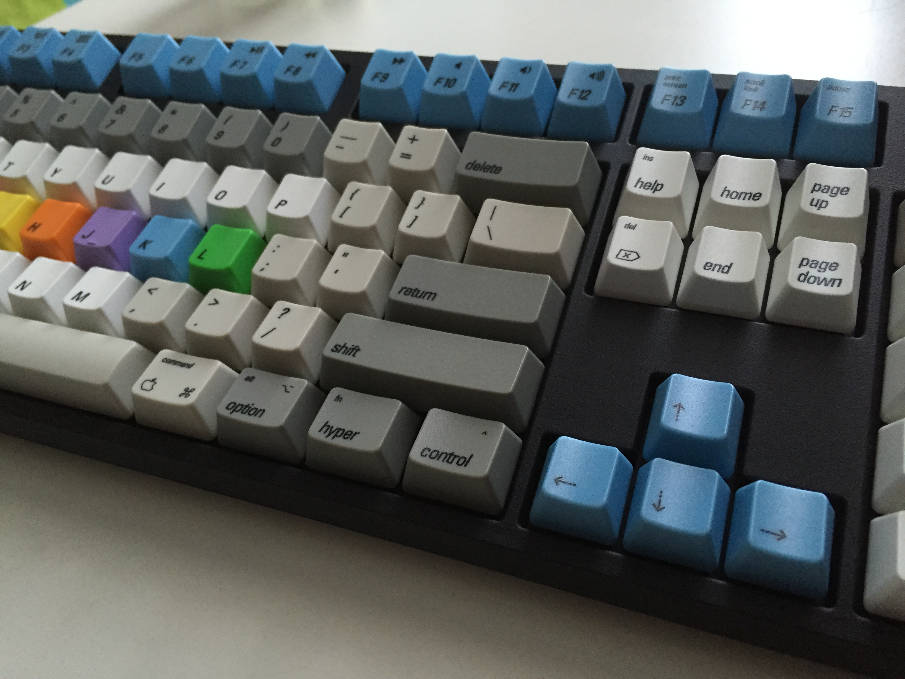
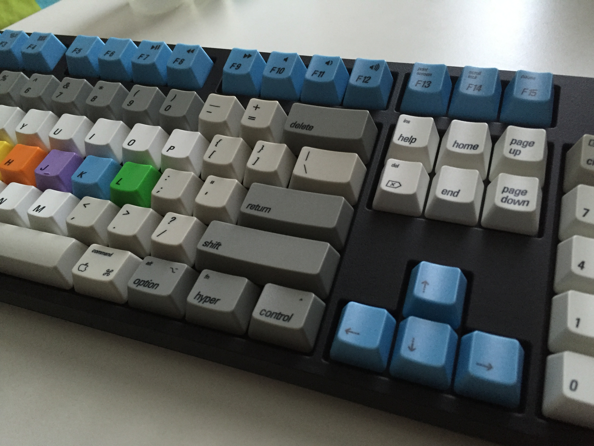
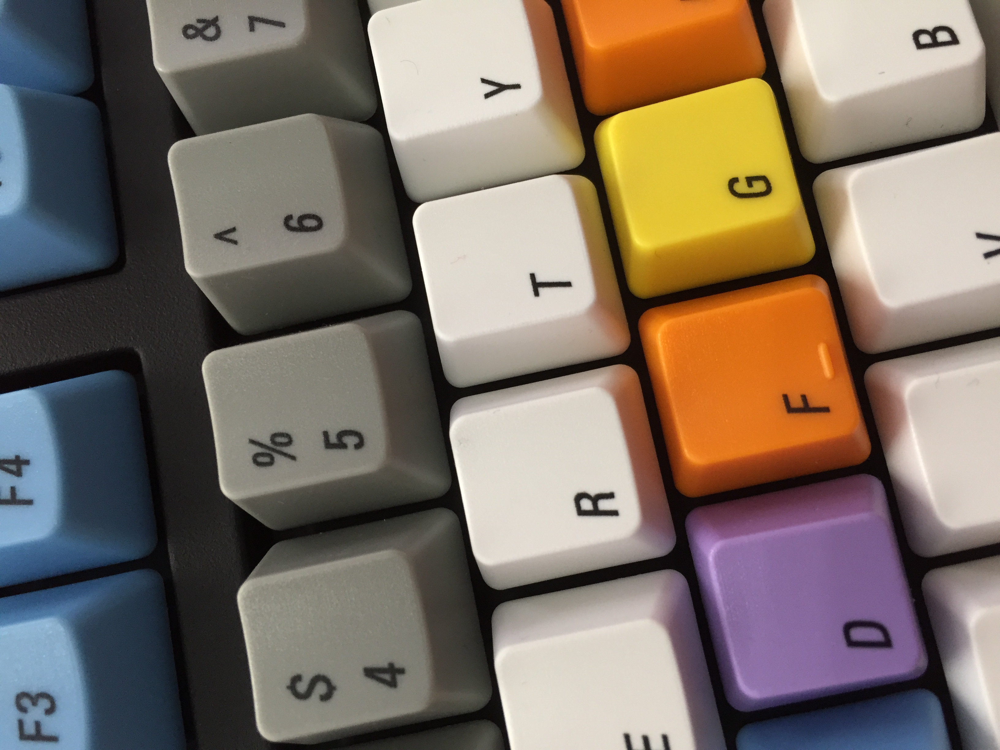

# Keycaps Inspired by Apple Extended Keyboard II

## Description
After buying an old Apple Extended Keyboard II on ebay, 

I decided to make myself a copy of the keycaps as a layout ([svg layout](svg/apple-wasd-layout.svg)) for a Cherry MX based mechanical keyboard.  WASD offer a service to make custom key caps for $50 a set (104/5 key set.)

## Notes 

My keyboard layout is geared towards Emacs use, and the fn key is labelled as **Hyper**. The Caps Lock is noticably absent, in it's place is another **Control** key.  I've also created a couple of Karabiner hacks **TODO**, I need to add them to this document for future reference.

The colored key caps in the WASD were added as an experiment to see if I can use them to aid my touch typing. I'm generally around 30wpm at the moment, and I'd like to improve significantly.  Having the rainbow of keys on my home row, "should" allow me to orient myself quickly if my hands stray. (My most common typing failure is to g/h or y/t instead of the other, similar mishaps occur with c/v and i/u.)  - **TODO** I'll try to add an a note on the effect of this.  Note this keyboard is for use in my office, I use the Apple Extended II at home, however, I really like the feel of the Cherry MX Green switches. (I have yet to remove a couple of damps from the AEKII which might even out the feel a bit.) The AEKII is an excellent keyboard too, and at 20 or so years old, it's in fantastic shape.

## The font, modified Univers 57 Oblique

After a little research I found out that the older Apple Keyboards use the Universe 57 Oblique font (although it's a slightly modified version than the one which can be purchased from Linotype.) The @, $ and & are fairly different, and the _ - = + / | are custom drawn for the keyboard, as they are oversized and significantly different from the font glyphs.  Also notably, the letter spacing (or perhaps kerning) is much tighter than standard, I've tried to replicate this as faithfully as possible to the original. I also hand edited the $ and # glyphs on my layout, however I didn't tackle the @ or & although I would like to if I have another machine or key set made up.

There is (what appears to be) rounding of some sort on almost all of the glyphs, although this may be due to laser etching techniques in the early 90s, I haven't been able to find any concrete info about it.

Anyway, the results of my work are what you see here, the [svg](svg/apple-wasd-layout.svg) reproduction took a little over 4 hours to put together. WASD turned it around and shipped it to Singapore in about a week.  Please feel free to grab the svg and use it yourself, or modify it.  I expect this could be seen as copyright infringement by Apple, but I hope it's just regarded as an homage.

The only things I am slightly displeased about for this project was my choice of symbol for the Control keys, which is far smaller than I'd like.  I will amend it if I order another keyset or complete keyboard.

Hope you enjoy it too. Feel free to have your own made up, the SVG as is will upload and match to a WASD 104 key set.

