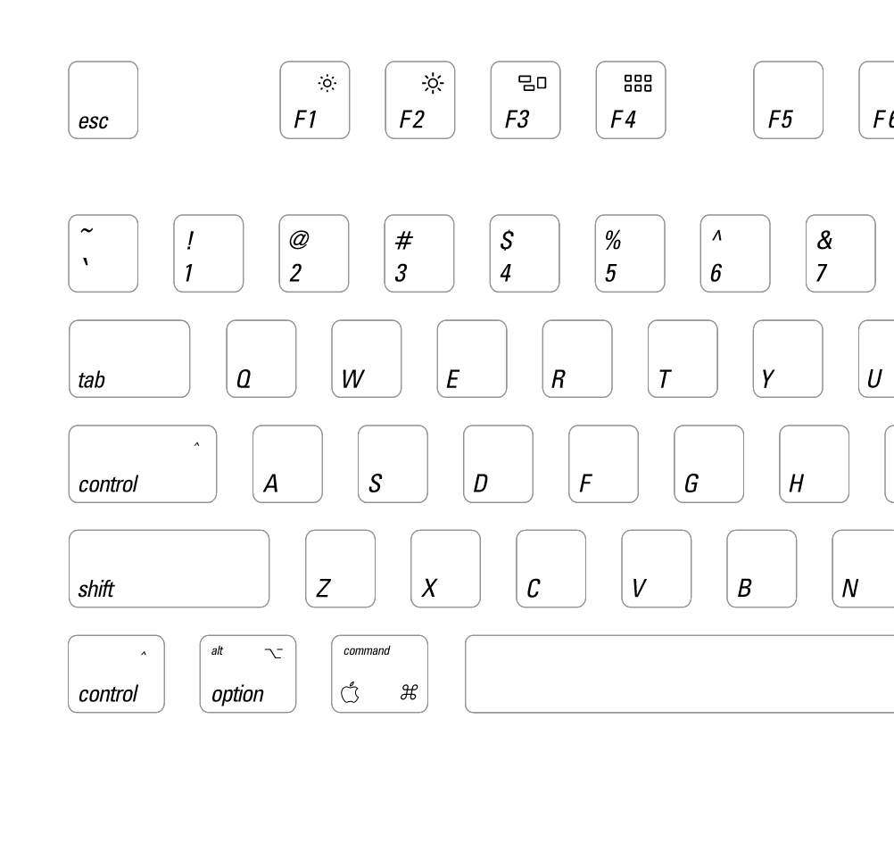

# Keycaps Inspired by Apple Extended Keyboard II

## Description

After buying an Apple Extended Keyboard II on ebay, I decided to make
myself a copy of the keycaps as a layout for a
[WASD](http://www.wasdkeyboards.com/) keyboard. The make custom Cherry
MX compatible key caps for $50/set (87/88/104/105 key sets are
available.) They also build a pretty solid mechanical keyboard. I
ordered a 104 key Cherry MX Green keyboard last week, I'm typing with
it now.

#### Apple Extended Keyboard II

Read more at [AEKII Wiki](http://deskthority.net/wiki/Apple_Extended_Keyboard_II)

### The Layout

##### Closeup detail

## Notes

My keyboard layout is geared towards Emacs use, and the fn key is
labelled as **Hyper**. The Caps Lock is noticably absent, in it's
place is another **Control** key.  I've also created a couple of
Karabiner hacks **TODO**, I need to add them to this document for
future reference.

The colored key caps in the WASD were added as an experiment to see if
I can use them to aid my touch typing. I'm generally around 30wpm at
the moment, and I'd like to improve significantly.  Having the rainbow
of keys on my home row, "should" allow me to orient myself quickly if
my hands stray. (My most common typing failure is to g/h or y/t
instead of the other, similar mishaps occur with c/v and i/u.)  -
**TODO** I'll try to add an a note on the effect of this.  Note this
keyboard is for use in my office, I use the Apple Extended II at home,
however, I really like the feel of the Cherry MX Green switches. (I
have yet to remove a couple of damps from the AEKII which might even
out the feel a bit.) The AEKII is an excellent keyboard too, and at 20
or so years old, it's in fantastic shape.

## The font, modified Univers 57 Oblique

After a little research I found out that the older Apple Keyboards use
the Universe 57 Oblique font (although it's a slightly modified
version than the one which can be purchased from Linotype.)

These keyboard glyphs are different to those the stock font:

    @ # $ &  _ - = + / | \

The `_ - = + / | \` are significantly larger and feature regular
orientation (they're not oblique.)

The letter spacing / kerning is tighter than standard, I've tried to
reproduce this modification faithfully to the original.

I hand edited the `$ # _ - = + / | \` glyphs on my layout. I didn't
tackle the `@ &` glyphs although I'd like to, especially if I have
another machine or key set made up.

There is rounding on these glyphs:

    2 3 6 9 S s G g J j C c

I didn't implement that on my layout design, it will require editing
the font.  I may well attempt this, hopefully this could be done with
Robofont.

The layout took a little over 4 hours to put complete.

After ordering/uploading WASD turned it around and shipped it to
Singapore (from CA USA) in about a week.  The results are impressive.

#### Finished keyboard

## Licence

[Creative Commons by-nc](http://creativecommons.org/licenses/by-nc/3.0/sg/)
